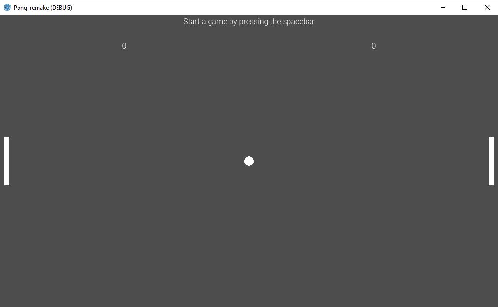

# Pong-Remake
A simple recreation of the classic game Pong inside of Godot (GDScript)

## Installation

This page shows the coding repository: [HERE](https://github.com/KobyS82/Pong-Remake)

 

## Usage

To view this page you will need to copy down this repository and run it inside of Godot.

You can download Godot with this link: [HERE](https://godotengine.org/download/windows/)

Open up the repository inside of Godot and press the play button on the top right.

## Credits

GodotTutorials on YouTube, for Godot basics, https://www.youtube.com/@GodotTutorials

